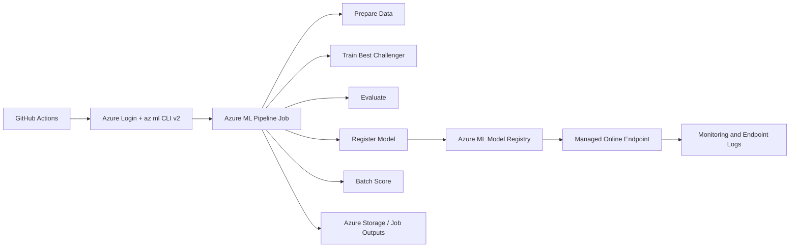

[](https://learn.microsoft.com/azure/machine-learning/)
[](https://mlflow.org/)
[](https://github.com/features/actions)

# BTC Direction MLOps on Azure

This repository is an Azure-first MLOps portfolio project built around a real BTC/USDT direction classifier. It shows how to take an existing Python ML workflow and turn it into an Azure Machine Learning v2 system with reusable pipeline components, model registration, managed online deployment, and GitHub-to-Azure CI/CD.

## What this project shows
- Feature engineering and model training for BTC direction prediction
- Azure ML v2 component-based orchestration
- MLflow-backed experiment tracking and model registration inside Azure ML
- Managed online endpoint deployment for real-time inference
- GitHub Actions automation for train and deploy flows
- A cleaner production story than committing runtime artifacts back into Git

## Architecture


## Azure services used
| Service | Why it is here |
| --- | --- |
| Azure Machine Learning Workspace | Central place for jobs, models, environments, and endpoints |
| Azure ML Compute Cluster | Remote CPU execution for training and scoring |
| Azure ML Environments | Reproducible dependency management |
| Azure Blob Storage via Azure ML datastores and outputs | Store pipeline artifacts outside Git and persist the raw BTC candle cache across Azure runs |
| Azure ML Model Registry | Version and promote trained models |
| Managed Online Endpoints | Real-time serving for recruiter demos |
| GitHub Actions | CI/CD entry point for test, train, and deploy |
| MLflow in Azure ML | Model lifecycle and experiment logging within Azure |

## Repo structure
| Path | Purpose |
| --- | --- |
| `src/btc_pipeline/` | Core BTC feature engineering, training, evaluation, and packaging logic |
| `src/btc_pipeline/azureml_jobs/` | Azure ML component entrypoints that reuse the existing model code |
| `azureml/` | Azure ML environments, components, pipelines, compute, and endpoint templates |
| `.github/workflows/` | GitHub Actions for CI, Azure training, deployment, and scheduled retraining |
| `docs/` | Public portfolio documentation |
| `tests/` | Unit tests |

## Main MLOps flow
The primary Azure pipeline is [`azureml/pipelines/train_register_score.yml`](/C:/Users/emman/Desktop/PROYECTOS_VS_CODE/GITHUB/btc-hourly-tournament/azureml/pipelines/train_register_score.yml). It runs five stages:

1. `prepare_data`: fetch BTC candles and build train/validation/future splits
2. `train_model`: train the challenger zoo and package the best model
3. `evaluate_model`: compute validation metrics
4. `register_model`: log and register the winning model with MLflow in Azure ML
5. `batch_score`: write the next-direction prediction artifact

The `prepare_data` step also writes a persistent raw-candle cache to the Azure ML default blob-backed datastore at:

`azureml://datastores/workspaceblobstore/paths/btc-mlops/raw-cache/`

That means the first cloud run fetches the full BTC history, while later runs refresh only the newest missing candles instead of rebuilding the dataset from scratch.

## Real-time serving contract
The managed endpoint serves the latest registered model from [`azureml/endpoints/`](/C:/Users/emman/Desktop/PROYECTOS_VS_CODE/GITHUB/btc-hourly-tournament/azureml/endpoints).

Expected response shape:
- `prob_up`

Sample request payload:
- [`azureml/sample-request.json`](/C:/Users/emman/Desktop/PROYECTOS_VS_CODE/GITHUB/btc-hourly-tournament/azureml/sample-request.json)

## Local setup
```bash
python -m pip install --upgrade pip
pip install -r requirements.txt
python -m unittest discover -s tests -v
```

## Azure setup
Create Azure resources and register the runtime:

```bash
az extension add -n ml -y
az configure --defaults group=<resource-group> workspace=<workspace-name>
az ml compute create --file azureml/compute/cpu-cluster.yml
az ml environment create --file azureml/environments/training-env.yml
```

## Submit the training pipeline
```bash
az ml job create \
  --file azureml/pipelines/train_register_score.yml \
  --set inputs.registered_model_name=btc-direction-model
```

## Deploy the managed online endpoint
```bash
az ml online-endpoint create --file azureml/endpoints/btc-direction-endpoint.yml
az ml online-deployment create --file azureml/endpoints/btc-direction-deployment.yml --all-traffic
```

## Invoke the endpoint
```bash
az ml online-endpoint invoke \
  -n btc-direction-endpoint \
  --request-file azureml/sample-request.json
```

## CI/CD
This repo now uses a focused workflow set:

- [`ci.yml`](/C:/Users/emman/Desktop/PROYECTOS_VS_CODE/GITHUB/btc-hourly-tournament/.github/workflows/ci.yml): unit tests and Azure asset checks
- [`train-azure.yml`](/C:/Users/emman/Desktop/PROYECTOS_VS_CODE/GITHUB/btc-hourly-tournament/.github/workflows/train-azure.yml): submit Azure ML pipeline jobs
- [`deploy-endpoint.yml`](/C:/Users/emman/Desktop/PROYECTOS_VS_CODE/GITHUB/btc-hourly-tournament/.github/workflows/deploy-endpoint.yml): deploy the latest registered model
- [`schedule-retrain.yml`](/C:/Users/emman/Desktop/PROYECTOS_VS_CODE/GITHUB/btc-hourly-tournament/.github/workflows/schedule-retrain.yml): scheduled retraining trigger

The recommended authentication pattern is GitHub OIDC with `azure/login`. A service principal secret-based setup also works and is documented by Microsoft, but OIDC is the cleaner production story.

## Why this is stronger than the previous version
- The repo now highlights Azure ML instead of DagsHub-centric tracking
- The public story is one polished end-to-end MLOps flow
- Azure assets and deployment templates are versioned in the repo
- Runtime outputs are designed for Azure storage and registries, not Git commits
- Recruiters can evaluate both the ML code and the platform engineering

## Notes
- Some legacy local scripts remain for historical reference, but the supported portfolio path is the Azure ML workflow.
- Private Azure study notes are intentionally excluded from Git through `.gitignore`.

## License
This project is licensed under the MIT License. See [LICENSE](/C:/Users/emman/Desktop/PROYECTOS_VS_CODE/GITHUB/btc-hourly-tournament/LICENSE).
